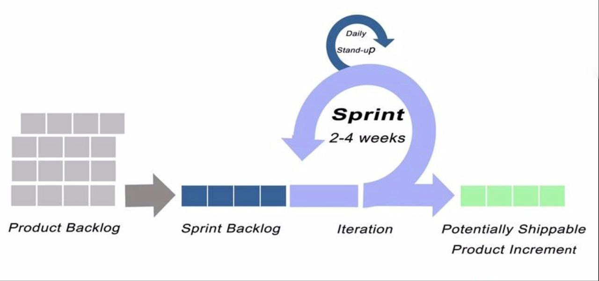

# Ablauf

## Small Talk

Danke sehr, dass Sie sich die Zeit genommen haben. Ich freue mich, hier zu sein. Wie sollten wir dieses Gespräch machen?

## Selbstvorstellung(CV)

Mein Name ist Luo Pengzhao und komme aus China.  
Im Sommer 2021 habe ich ein Praktikum als Geomatiker in einem Unternehmen in Shanghai gemacht, das im Bereich Digital Twin tätig ist. Im Jahr 2022 habe ich meinen Bachelor in Geoinformatik an der Shanghai Ocean University abgeschlossen. Nach dem Abschluss habe ich in Peking, der Hauptstadt Chinas, als technischer Grafiker gearbeitet. Während dieser Zeit habe ich festgestellt, dass ich aufgrund des langen Corona-Shutdowns eine Ruhephase benötigte, weshalb ich diese Stelle verlassen habe.

### Qualifikation

- Anabin
  - anerkannte Universität
  - Hochschulabschluss
    - Gradverleihungsurkunde
    - Abschlusszeugnis
- Notarielle Urkunde
  - Zhili-Notariats der Stadt Baoding der Provinz Hebei
  - Konsularabteilung des chinesischen Außenministeriums
  - Botschaft der Bundesrepublik Deutschland Peking
- GIS
  - Erfassen und Beschaffen von Geodaten
  - Verarbeiten, Verwalten und Veranschaulichen von Geodaten
  - Modellieren von Geodaten und Aufbereiten in unterschiedliche Formate für verschiedene Medien
  - Nutzen der Informations- und Kommunikationssysteme der Geomatik
  - kundenorientiertes Durchführen von Aufträgen unter Verwendung von Geodaten
  - Mitwirken in der Kundenberatung und Anwenden von Marketingstrategien
  - Anwenden von Methoden der visuellen Kommunikation und grafischen Gestaltung von Karten sowie Vermittlung und Darstellung komplexer räumlicher Sachverhalte
  - Umsetzen von Geodaten in Karten, Präsentationsgrafiken und multimediale Produkte
  - Anwenden von Informations- und Kommunikationstechniken
  - Beachten der berufsbezogenen Rechts- und Verwaltungsvorschriften
  - Anwenden naturwissenschaftlicher und mathematischer Grundlagen der Geoinformationstechnologie
  - teamorientiertes und qualitätssicherndes Arbeiten

### Berufserfahrung

- Shanghai
  Damals waren meine Hauptaufgaben die Bearbeitung Geodaten. Außerdem habe ich während dieser Zeit 3D-Rendering, insbesondere Unity-Shader, gelernt. Ich erinnere mich gut daran, dass 51World einige 3D-digitale Stadtmodelle (Peking, Shanghai, Guangzhou) erstellt hat, obwohl nur Offline-Rendering unterstützt wurde und kein Echtzeit-Rendering für die Spieleentwicklung möglich war.
- Peking
  Nach zwei Monaten der kurzen Arbeit in Peking habe ich erst gemerkt, dass ich eigentlich wegen des Shutdowns krank war und eine Pause brauchte. Deshalb, nachdem ich meinen Job in Peking gekündigt hatte, erholte ich mich mit meiner Familie zu Hause und begann dann mit der Jobsuche. Ende 2022 gab es jedoch eine Entlassungswelle in der chinesischen IT-Branche, und die Absolventen des Jahrgangs 2022 wurden aufgrund des langen Shutdowns in Shanghai bei der Jobsuche benachteiligt. Daher entschied ich mich, zunächst in der Einzelhandelsbranche zu arbeiten. Während dieser Zeit lernte ich eine zweite Fremdsprache, Deutsch, und machte auch Bekanntschaft mit der deutschen Kultur, die mir sehr gefiel. So bin ich jetzt hier.

## IT Kenntnisse

### Scrum

  
Der Product Owner passt das Sprint-Backlog ständig an die Prioritäten der Kundenanforderungen an, damit das Entwicklungsteam weiterarbeiten kann. Jeder Sprint dauert etwa 15 Tage, und es gibt jeden Tag ein Stand-up-Meeting. Am Ende jedes Sprints gibt es ein Sprint-Review-Meeting, um die mögliche, produzierte Software zu überprüfen.

### Docker

**Docker** is an engine that allows you to run containers. Containers are packages of software that can run reliably in different environments. Containers include everything needed to run the application. Containers are lightweight in comparison to virtual machines.
A **Dockerfile** is a text document that contains all the commands and instructions necessary to build a Docker Image.
A **Docker image** is an executable package comprised of code, dependencies, libraries, a runtime, environment variables, and configuration files.
A **Docker container** is a runtime instance of a Docker Image.

### GDPR

- two-factor authentication
  Github, Discord: password + google authenticator code/recovery code(kept in BitWarden)
- end-to-end encryption
  GDPR compliance is achieved with Proton Mail using E2EE.  
  For example, A writes a message to B  
  sender uses receiver´s **public key** to encrypt the message as **ciphertext** which can only be decrypted by the corresponding private key  
  Server only backs up already encrypted messages and never sees plain text messages  
  receiver use own **private key** to decrypt sender´s message  
  receiver reads the message from sender
- [cookies](https://gdpr.eu/cookies/)

### DevOps

DevOps lifecycle: Planning, Coding, Building, Testing, Release & Deployment and Monitoring

- CI
  Auto build and test once a commit is pushed to the remote repository.
- CD
  Auto release and deploy once a person marks a version tag after the build and tests have passed.

### SQL

### Algorithm

## General question

### Persönlichkeit

ISTP
Action-orientiert, logisch, analytisch, spontan, zurückhaltend, unabhängig. Genießt Abenteuer, geschickt darin, wie mechanische Dinge funktionieren zu verstehen.

### Beeindruckender Erfolg

Hmm. Ich glaube, dass ich jemand bin, der ganz gut darin ist, die eigenen Fehler zu erkennen und daran zu wachsen. Es geht um effektiveres Deutschlernen. Seit meiner Kindheit habe ich mich dafür interessiert, im Ausland zu arbeiten. Deutschland bietet eine gute Chance. Daher entschied ich mich, Deutsch in meiner Freizeit zu lernen. Nachdem ich viele Beiträge im Internet recherchiert hatte, fand ich das vhs-Lernportal, auf dem Deutschkurse von Niveau A1 bis B2 verfügbar sind. Da ich noch berufstätig war, konnte ich nicht so intensiv Deutsch lernen wie Englisch an der Universität. Da Englisch und Deutsch ähnlich sind, habe ich Deutsch mit Englisch gelernt, weil ich durch den Unterschied effektiver lernen konnte. Damals war ChatGPT sehr populär. Daher lernte ich, wie man ChatGPT benutzt. Dennoch bot ChatGPT nicht immer die richtigen Antworten. Danach trat ich einer Discord-Community bei, um mich mit anderen beim Deutschlernen auszutauschen. Obwohl es fast ein perfekter Ablauf war, merkte ich, dass ich noch einen chinesischen Sprachpartner brauchte, um den mündlichen Teil der Goethe-Prüfung zu bestehen und schließlich in Deutschland arbeiten zu können. So entstand dieses gesamte Ablaufsystem, das ich selbst entwickelt habe.

### Beeindruckendes Versagen

Nun habe ich 2 Goethe-Zertifikate, also B1 und B2. Es war sehr erfolgreich, B1 zu bestehen. Aber der B2-Teil HÖREN hat mir sehr viele Schwierigkeiten bereitet. Ich habe den B2-Teil HÖREN 4 Mal abgelegt und endlich bestanden, weil ich nur viele Modellprüfungen gemacht habe. Und das vhs-Lernportal bietet nur einen B2-Berufskurs, der den Anforderungen des Goethe-Zertifikats B2 nicht so entspricht. Um beim vierten Versuch zu bestehen, habe ich außerdem DfD B2 HÖREN-Übungen vom Goethe-Institut und DW B2 Video-Thema-Übungen usw. gemacht. Alles ist kostenlos, und ich bedanke mich für die Entwicklung dieser Plattformen. Von dieser Erfahrung habe ich gelernt, dass ich die beste Vorbereitung treffen und das Schlimmste erwarten sollte.

### Stäken

- unabhängig
  Meine Familie lebt von Generation zu Generation auf dem Land, aber ich bin der erste Student in der Luo-Familie im Dorf. Ich glaube, der sogenannte 'China Dream', der von den meisten Menschen in China verfolgt wird, passt mir nicht, und ich sollte so schnell wie möglich das verfolgen, was ich im Inneren will. Also Individualismus Kultur. Zuerst haben meine Familie und ich uns nicht wirklich verstanden, aber mit der Zeit haben sie ihre Denkweise geändert und unterstützen mich jetzt voll und ganz.
- logisch und sorgfältig
  Ab dem Gymnasium war ich sehr interessiert an Mathe und Englisch. Danach habe ich an der Uni einen C-Programmierungskurs gemacht, und er gefiel mir sehr. Daher wechselte ich zu Geoinformatik.

### Schwäche

- zu direkt
  Manchmal bin ich zu direkt, was dazu führen kann, dass meine Aussagen unhöflich wirken. Ich arbeite daran, sensibler zu sein und den richtigen Ton zu treffen.

### Warum Deutschland nicht China?

- Umweltfreundlich

### Warum unser Unternehmen?

- Technologiestack aus der Stellenbeschreibung
- Hintergrund des Interviewers von LinkedIn
- Produkt und Geschäft

### Stress

- Sport treiben
  - Laune heben
  - Fokus schärfen
  - Strss abbauen
  - Schlaf verbessern
- Regelmäßig kurze Pausen machen
  Langfristiger Stress kann zu beruflicher Erschöpfung führen. Dadurch kann ich arbeitsorientiert bleiben.

### Vorbild

Steve Jobs  
Stay hungry, stay foolish.

### Konflikt mit Kollegen

- Proaktiv auf die andere Partei zugehen, um ihre Perspektive vollständig zu verstehen.
- Nicht über die Handlungen der anderen urteilen.
- Falls notwendig, rechtzeitig die zuständigen Autoritäten einschalten.
- Nachdem der Konflikt gelöst wurde, den Kontakt suchen, um die Beziehung zur anderen Partei weiter zu stärken.

### Mit der Leitung nicht einverstanden sein

Es ist eine gute Praxis, meine Philosophie bezüglich Entscheidungen zu teilen, also aktiv in die Entscheidungsdiskussion eingebunden zu sein, damit meine Stimme gehört wird und ich dem Entscheidungsträger helfe, die richtige Entscheidung zu treffen, indem alle relevanten Daten und unterschiedlichen Perspektiven vor der Entscheidungsfindung berücksichtigt werden. Sobald eine Entscheidung getroffen wurde, sollte ich dieser folgen und sie unterstützen, auch wenn ich nicht einverstanden bin.

### Was machen Sie zur Zeit?

Bisher habe ich meiner Familie auf dem Land unterstützt. Dadurch habe ich gemerkt, dass ich hohe, mehrstöckige Gebäude nicht mag und einen besseren Job benötige. So entsprechen die deutschen Städte eher meinen Vorstellungen.

## Noch Frage/Aussage

- Welche Hilfe bieten Sie beim Integrationsprozess an?
- Mit welchen Wörtern würden Sie die Kultur des Teams beschreiben?
- Was sind die größten Herausforderungen, denen sich jemand in dieser Rolle stellen muss?
- Ich möchte kurz darüber denken.
- Könnten Sie mir bitte einen Tag Zeit geben, um zu entscheiden, ob ich das Angebot annehme?
- Keine Frage mehr. Es war sehr interessant, mit Ihnen zu sprechen. Ich wünsche Ihnen einen schönen Tag. Tschüss!
